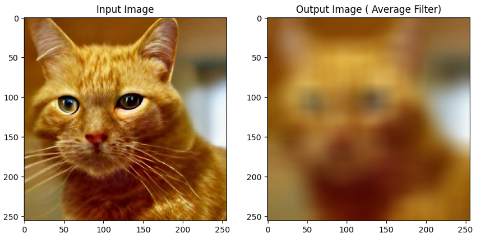
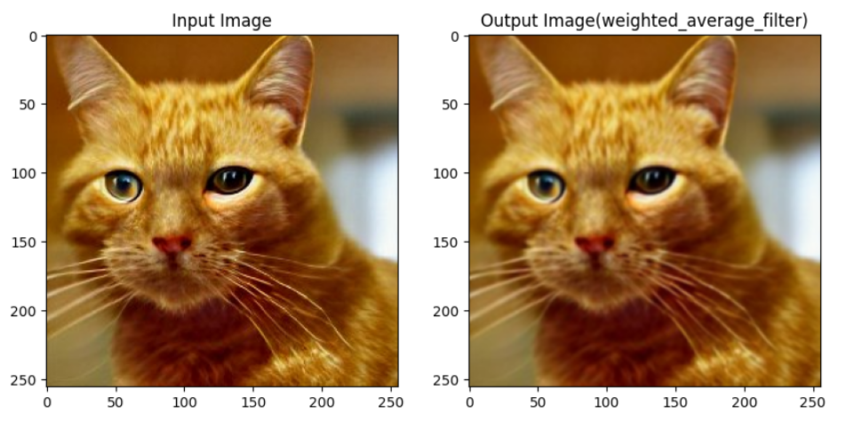
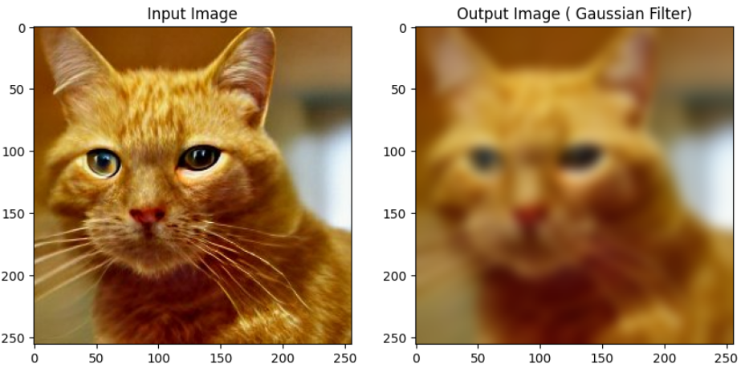
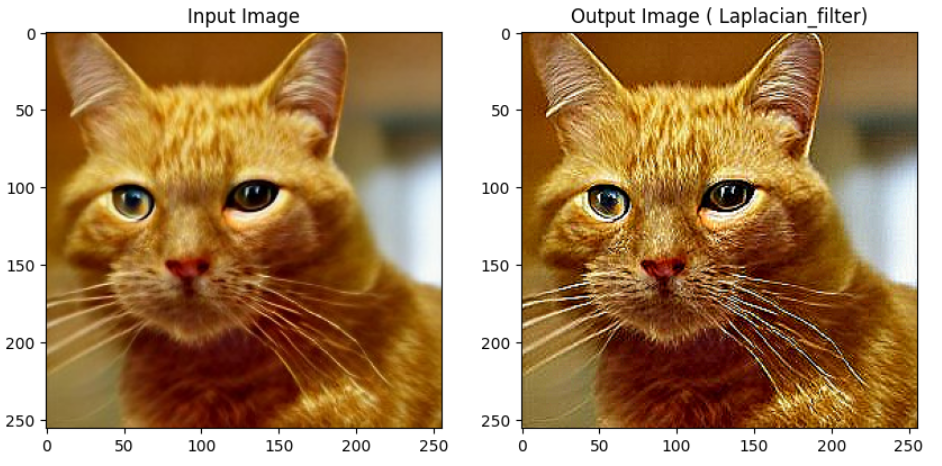
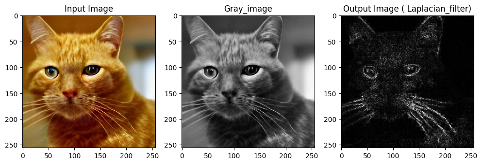

# Implementation of Filters

## Aim
To implement filters for **smoothing** and **sharpening** images in the **spatial domain** using Python and OpenCV.

---

## Software Required
- **Anaconda – Python 3.7**
- **OpenCV** library
- **NumPy** library

## Algorithm

**Step 1:**  
Import necessary libraries like `cv2` and `numpy` for image processing.

**Step 2:**  
Read the input image using `cv2.imread()` and convert it to grayscale if required.

**Step 3:**  
Apply **smoothing filters** such as Averaging, Weighted Averaging, Gaussian, and Median filters to reduce image noise and enhance smoothness.

**Step 4:**  
Apply **sharpening filters** using Laplacian Kernel and Laplacian Operator to highlight edges and fine details in the image.

**Step 5:**  
Display all filtered images using `cv2.imshow()` and close all OpenCV windows using `cv2.destroyAllWindows()`.

---

## Program

```python
## Developed By : HARIHARAN J
## Reg No : 212223240047 

import cv2
import numpy as np
import matplotlib.pyplot as plt

# Define a Kernel
kernel = np.ones((5,5), dtype = np.float32) / 5**2
print (kernel)

# To Perform Convolution 
image = cv2.imread('cat39.jpeg')
dst = cv2.filter2D(image, ddepth = -1, kernel = kernel)

plt.figure(figsize = [10,7])
plt.subplot(121); plt.axis('off'); plt.imshow(image[:,:,::-1]); plt.title("Original Image")
plt.subplot(122); plt.axis('off'); plt.imshow(dst[:,:,::-1]);   plt.title("Convolution Result");

# # 1. Smoothing filter 
# -by convolving the image with a 5x5 kernel
# # i) Using Averaging Filter

average_filter = cv2.blur(image, (30,30))

# Display the images.

plt.figure(figsize = [10,7])
plt.subplot(121); plt.imshow(image [:, :, ::-1]); plt.title('Input Image')
plt.subplot(122); plt.imshow(average_filter[:, :, ::-1]); plt.title('Output Image ( Average Filter)')

# # ii) Using Weighted Averaging Filter (custom kernel)   
# -  The middle pixel gets the maximum weight while the pixels farther away are given less weight.

kernel = np.array([[1,2,1],
                   [2,4,2],
                   [1,2,1]])/16
weighted_average_filter = cv2.filter2D(image, -1, kernel)


# Display the images.
plt.figure(figsize = [10,7])
plt.subplot(121);plt.subplot(121); plt.imshow(image [:, :, ::-1]); plt.title('Input Image')
plt.subplot(122);plt.imshow(weighted_average_filter[:, :, ::-1]); plt.title('Output Image(weighted_average_filter)');plt.show()

# Apply Gaussian blur.
gaussian_filter = cv2.GaussianBlur(image, (29,29), 0, 0)

# Display the images.

plt.figure(figsize = [10,7])
plt.subplot(121); plt.imshow(image [:, :, ::-1]); plt.title('Input Image')
plt.subplot(122); plt.imshow(gaussian_filter[:, :, ::-1]); plt.title('Output Image ( Gaussian Filter)')


# iv) Using Median Filter
median_filter = cv2.medianBlur(image, 19)

# -  median filter is often used for removing salt-and-pepper noise (random black-and-white pixels) in an image. It is effective at preserving edges while smoothing out the noise.

# Display the images.

plt.figure(figsize = [10,7])
plt.subplot(121); plt.imshow(image [:, :, ::-1]); plt.title('Input Image')
plt.subplot(122); plt.imshow(median_filter[:, :, ::-1]); plt.title('Output Image ( Median_filter)')

 
## 2. Sharpening Filters

# i) Using Laplacian Kernel (Manual Kernel)
laplacian_kernel = np.array([[0, -1, 0],
                             [-1, 5, -1],
                             [0, -1, 0]])
sharpened_laplacian_kernel = cv2.filter2D(image, -1, kernel = laplacian_kernel)

# Display the images.

plt.figure(figsize = [10,7])
plt.subplot(121); plt.imshow(image [:, :, ::-1]); plt.title('Input Image')
plt.subplot(122); plt.imshow(sharpened_laplacian_kernel[:, :, ::-1]); plt.title('Output Image ( Laplacian_filter)')


# ii) Using Laplacian Operator (OpenCV built-in)
gray_image = cv2.cvtColor(image, cv2.COLOR_RGB2GRAY)
laplacian_operator = cv2.Laplacian(gray_image, cv2.CV_64F)
laplacian_operator = np.uint8(np.absolute(laplacian_operator))


# Display the images.

plt.figure(figsize = [12,8])
plt.subplot(131); plt.imshow(image [:, :, ::-1]); plt.title('Input Image')
plt.subplot(132); plt.imshow(gray_image, cmap='gray'); plt.title('Gray_image')
plt.subplot(133); plt.imshow(laplacian_operator,cmap='gray'); plt.title('Output Image ( Laplacian_filter)')

```
## Output

### Smoothing Filters

**Using Averaging Filter**



**Using Weighted Averaging Filter**



**Using Gaussian Filter**



**Using Median Filter**


### Sharpening Filters

**Using Laplacian Kernal**



**Using Laplacian Operator**


 
## Result
Thus, the filters were successfully implemented for **smoothing** and **sharpening** the images in the **spatial domain** using Python and OpenCV.
